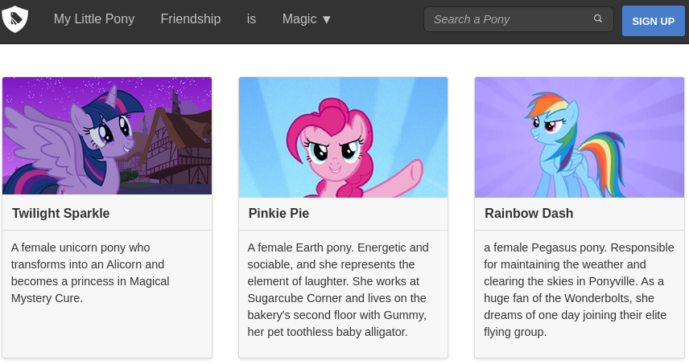

# Docker image for Bourbon

Bourbon is a lightweight mixin library for Sass - http://bourbon.io  
This image is a template based on the Bourbon intro [video](https://www.youtube.com/watch?v=8ItNE_DX6Cc).

## Prerequisites

* [docker](https://docs.docker.com/installation/mac)
* [docker compose](https://docs.docker.com/compose/install)

## Setup

    docker-compose build
    docker-compose up      # watch sass files and compile them into css/app.css

Open index.html in the browser and modify any sass or scss file using your text editor.

## Misc

To hide the neat's grid, make sure you have this line `$visual-grid: false !default;` in css/0-plugins/neat/settings/visual_grid.sass
